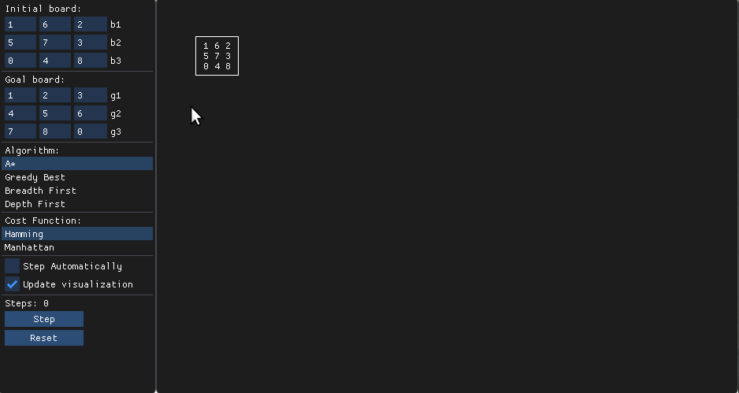

# 8-puzzle Solver

An 8 puzzle solver visualization aplication. Able to step manually, and visualize the graph expansion of the chosen search algorithm.
You can also choose the initial and goal board.

Supported search algorithm:
- Breadth first
- Depth first
- A*
- Greedy Best

Heuristic cost functions:
- Manhattan
- Hamming
